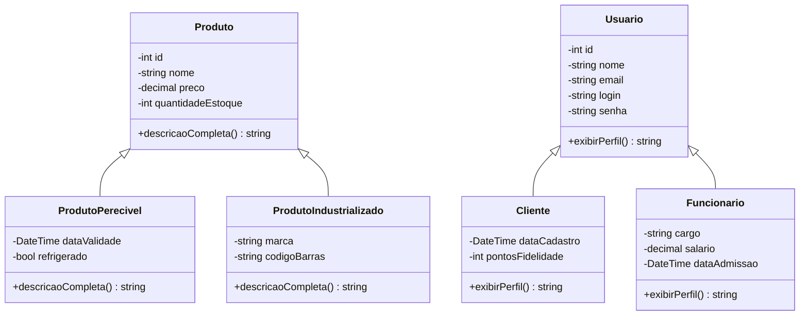

# Diagrama de Classes — Sistema de Gerenciamento da Padaria

O sistema possui **duas hierarquias de herança**, atendendo ao requisito
de no mínimo três classes em hierarquia (o trabalho tem seis).

Todos os atributos são **privados** (`-`), acessados via getters/setters
no C# — aplicando encapsulamento de forma consistente.

## Como ler

- As setas `<|--` representam **herança** (a subclasse "é um" tipo da
  classe base). Ex: `ProdutoPerecivel` herda de `Produto`.
- Cada subclasse **sobrescreve** o método da classe base
  (`descricaoCompleta` ou `exibirPerfil`), demonstrando **polimorfismo**.
- Os atributos com `-` são privados (encapsulamento). No C#, são
  acessados por meio de propriedades (`get`/`set`).

## Mapeamento para o banco

Cada hierarquia vira **3 tabelas** no MySQL (uma para a classe base e
uma para cada subclasse), ligadas pelo `id` via `FOREIGN KEY`.
Ver detalhes em `docs/contrato-banco.md`.
